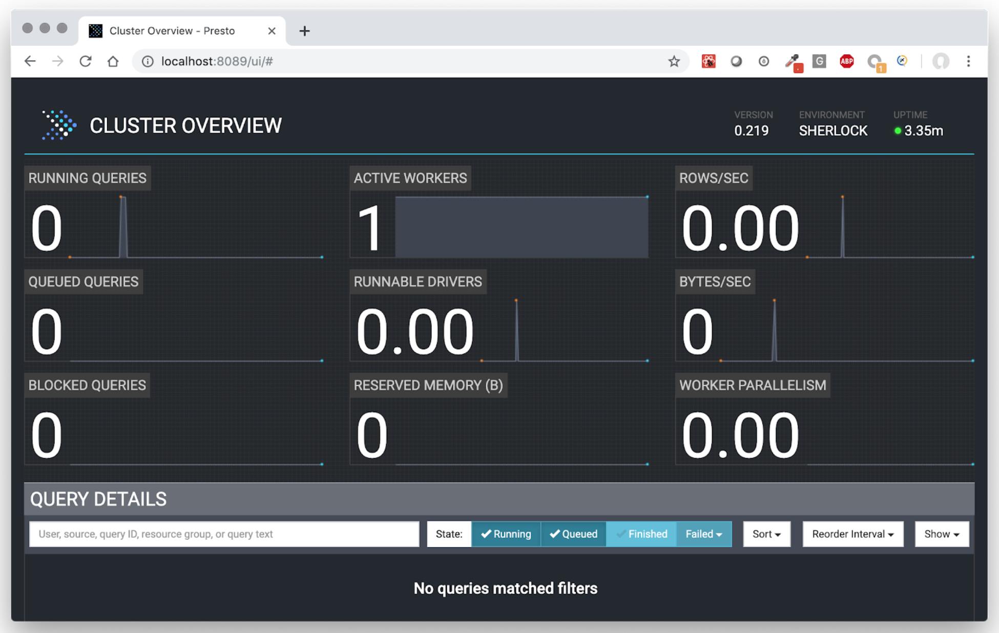

[BACK](./readme.md) to main page

# Deployment Guide

To make the deployment and scaling easy, we packaged all the main components to docker containers. We 
provide deployment scripts that can be used to perform various operational commands, like start and stop 
the cluster, or creating/restoring backups about metadata. The deployment is fully automatized, all you 
need to specify is some deployment configs.


## Before you start to use Sherlock
* You will need to have docker installed on your machine / on the servers, and it also helps if you get 
familiar with docker and swarm: https://www.docker.com/get-started 
* Also, in the scripts calculating memory configs for the Presto, we are using the command calculator 
line tool called `bc`. On mac it is installed by default, on linux you might need to install it 
(e.g. `apt-get install bc`)
* You need to download the sherlock code using `git clone https://github.com/NetBiol/sherlock.git sherlock` or if 
you are not familiar with git, you can also use the direct download link in your 
browser: https://github.com/NetBiol/sherlock/archive/master.zip 

## Deploying a single node sandbox cluster on your laptop

Allowing development and testing on small data sets, we provide a config which will result a small presto 
cluster, with a single presto worker node and a local S3 container. In this case, all the data you store 
in the data lake will end up in a local folder on your machine. Of course it is very unadvised to use this 
setup in production, as all your data can be lost easily and also you will have very limited analytical 
capacity. But this setup is very practical, as it can be executed on a single laptop and you can test your 
analytical queries in this way. We recommend you to use a relatively powerful laptop, with at least a 
dual-core CPU and 16 GB RAM, as around half of these resources can be consumed by Sherlock.

Deploying your sherlock sandbox cluster:
```
git clone https://github.com/NetBiol/sherlock.git sherlock
 
cd sherlock/infrastructure
 
export SHERLOCK_CONF=`pwd`/conf/config-example_sandbox_local-s3.conf

./start_local_s3.sh
./start_postgres.sh
./start_metastore.sh
./start_presto_coordinator.sh
./start_presto_workers.sh
```

To stop the whole Sherlock stack, you can use the `stop_sherlock.sh` command.

You will need to use the very same `start_` scripts in case of any kind of deployments. 
(With one exception: when you use S3 storage in the Cloud, you won’t need to use `start_local_s3.sh`). 
The main difference between the different deployments are controlled in the config file. By changing 
the config file or exporting a different config file, you can change the size of the cluster and also 
other important parameters.

You can check the full config file for the local sherlock sandbox 
here: https://github.com/NetBiol/sherlock/blob/master/infrastructure/conf/config-example_sandbox_local-s3.conf

In this config we specify that we will use a single Presto Worker, we assign very minimal resources 
to Presto, and we will use a local S3 service which will expose a local folder on our machine for Sherlock.

If everything works fine, you will be able to open the the Presto UI in your browser: http://localhost:8089 




## Using Presto CLI to execute Presto queries

Presto CLI is a command line tool, allowing you to execute SQL queries on the 
Presto cluster: https://prestosql.io/docs/current/installation/cli.html

If you don’t want to install Presto CLI, you can also execute it interactively in docker, 
using the `start_presto_cli.sh` command. This will start Presto CLI, connecting it to the Presto 
Coordinator and configuring to use the sherlock catalog.


## Use Sherlock on your laptop with real cloud storage

The next step can be to connect the Sherlock on your machine to a real S3 cloud storage. 
The following tutorial show you how to register an S3 ‘Space’ on 
Digital Oceans: https://www.digitalocean.com/community/tutorials/how-to-create-a-digitalocean-space-and-api-key

The tutorial showed you how to create access key for external applications to be able to manage your S3 space. 
You can use the config file we 
prepared: https://github.com/NetBiol/sherlock/blob/master/infrastructure/conf/config-example_sandbox_external-s3.conf

But make sure to set the following parameters in the sherlock config according your S3 space settings.
The bucket name is the name of the ‘space’ in Digital Oceans.

```
SHERLOCK_USE_LOCAL_S3="false"
SHERLOCK_BUCKET_NAME="your_bucket_or_space_name"
SHERLOCK_S3_ACCESS_KEY="your_sensitive_access_key"
SHERLOCK_S3_SECRET_KEY="your_super_protected_secret_key"
SHERLOCK_S3_END_POINT="ams3.digitaloceanspaces.com"
```

If you updated the config file, then you can use the Sherlock scripts to deploy your sandbox cluster in a way 
that it will use the S3 storage in the cloud. Note, that this time you use a different config path and you don’t need 
to execute the `start_local_s3.sh` command:

```
cd sherlock/infrastructure
 
export SHERLOCK_CONF=`pwd`/conf/config-example_sandbox_external-s3.conf

./start_postgres.sh
./start_metastore.sh
./start_presto_coordinator.sh
./start_presto_workers.sh
```

## Deploying a larger Sherlock cluster 

We can also create a simple config for deploying a small sherlock cluster to server or cloud machines. To be 
able to start and run Sherlock, first you will need to have a swarm cluster somewhere. Depending the 
capacity you need, you can scale your servers. In our examples we will assume you have two 32GB machines, 
each of them having 8 CPU cores. Somewhat similar setups can be found in all major cloud providers: 
* https://www.digitalocean.com/pricing/ 
* https://aws.amazon.com/ec2/instance-types/
* https://cloud.google.com/compute/docs/machine-types
* https://azure.microsoft.com/en-us/pricing/details/virtual-machines/linux/

Keeping 5 GB memory on each node for the operating system and for the smaller services (like metastore and 
postgres), we have 27 GB on each node free for Presto. This means we can run 6 Presto processes, 
1 coordinator and 5 workers. Assigning 2 CPU cores for each presto process, our scaling parameters in the 
config file will look like:

```
SHERLOCK_NUMBER_OF_WORKERS=5
SHERLOCK_PRESTO_CPU_CORES=2
SHERLOCK_MAX_PRESTO_PROCESS_MEMORY_GB=9
```

In general, having presto workers with more memory makes possible to execute more complex queries without reaching 
local memory limits. On the other hand, having more workers help you to execute more queries parallel. Also, You 
shouldn’t run production presto with less than 8 GB of memory per worker. Having 8-16 GB per worker seemed to us a good 
production config.

Don’t forget to also set the external S3 parameters, as we did before using a Digital Oceans Space.
You can create your own config file, or edit the sample config file we created:
https://github.com/NetBiol/sherlock/blob/master/infrastructure/conf/config-example_many-workers_external-s3.conf

After having the config file ready, you need to prepare the server nodes. The way of doing this depends on the linux 
distribution you use and the cloud provider you choose. But in general, you need to follow the following steps:
* Install docker on all nodes ([example with Digital Oceans](https://www.digitalocean.com/community/tutorials/how-to-install-and-use-docker-on-ubuntu-16-04))
* Prepare the firewall configs for docker swarm ([example with Digital Oceans](https://www.digitalocean.com/community/tutorials/how-to-configure-the-linux-firewall-for-docker-swarm-on-ubuntu-16-04))
* Initialize a swarm cluster, register all nodes ([docker documentation](https://docs.docker.com/engine/swarm/swarm-tutorial/create-swarm/))

Then you can copy the sherlock source code to the main node (either using `wget` or `git`), then start Sherlock with 
the following commands:

```
wget https://github.com/NetBiol/sherlock/archive/master.zip 
unzip ./sherlock-master.zip
cd sherlock-master/infrastructure 
 
export SHERLOCK_CONF=`pwd`/conf/config-example_many_workers_external-s3.conf

./start_postgres.sh
./start_metastore.sh
./start_presto_coordinator.sh
./start_presto_workers.sh
```

You can then execute queries in the Presto Command Line Interface, using `start_presto_cli.sh`.

To be able to use the large Presto cluster also from other machines, you need to expose the presto port on the internet. 
This port is set in the sherlock configs by the `SHERLOCK_PRESTO_PORT` attribute. It is enough to open this port only 
on one of the machines, and the swarm cluster will transfer all the traffic from this port to the Presto Coordinator. 

The way of opening / exposing ports in the cloud is different in each cloud providers. In Digital Oceans you can 
configure the droplets to have public network and Cloud Firewalls ([see here](https://www.digitalocean.com/docs/networking/firewalls/))
while e.g. on AWS you need to add an Internet Gateway to your VPC and change the security groups for the EC2 instances 
to expose the presto port ([see here](https://docs.aws.amazon.com/vpc/latest/userguide/VPC_Internet_Gateway.html)).

Securing the presto port with authentication can be done in many ways, but currently it is outside of the scope of Sherlock.
* You can see many different options in the [Presto documentation](https://prestodb.github.io/docs/current/security.html), 
but all these options require you to change the Docker containers we developed for Sherlock. 
* As Presto is using standard HTTP or HTTPS, an other option can be to configure a simple proxy instance in the cloud 
between the public network and your presto cluster.
* You can also setup an SSH tunnel with port forward between the main docker node and your machine, then you can use 
presto CLI locally (this is the way how we are using Sherlock in our laptops now).

---
© 2018, 2019 Earlham Institute ([License](sherlock_license.md))